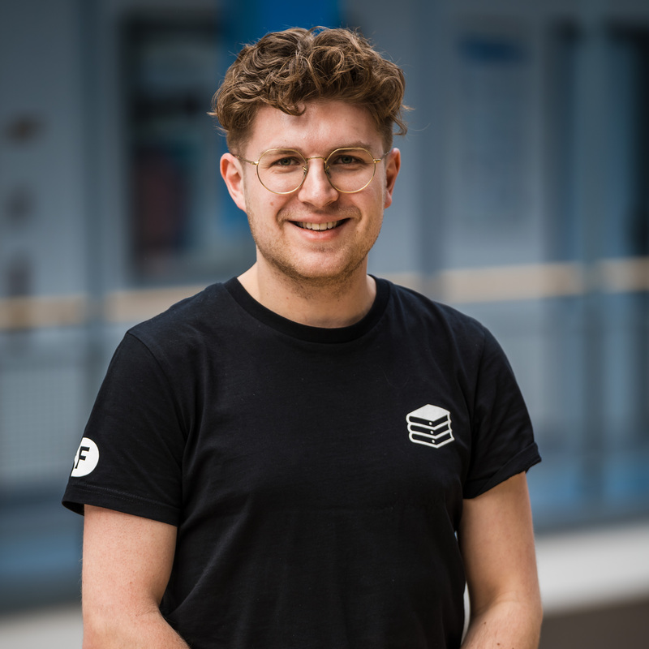
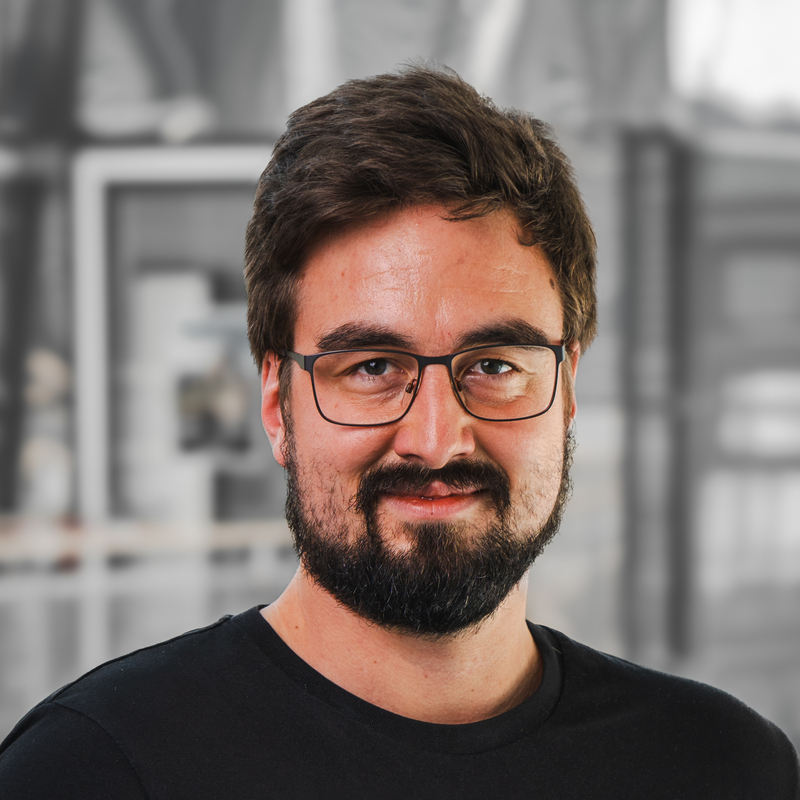
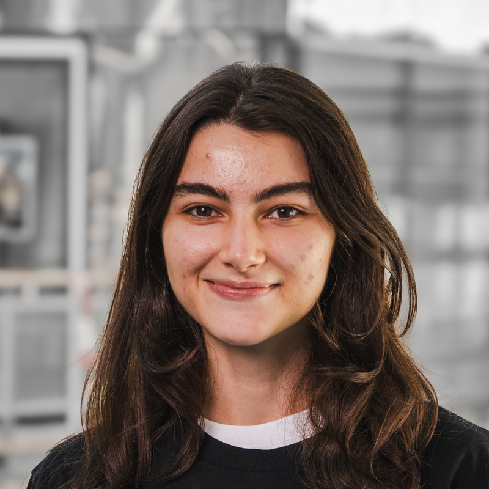

+++
menu = 'header'
title = 'about'
weight = 1
showMetadata = false
+++

Hey everyone,
we are a group of computer science students at the Technical University of Munich (TUM) enthusiastic about the realm of databases and data processing systems. Our initiative has been established with the purpose of fostering a collaborative community among like-minded students, researchers, and industry professionals who are interested in the latest developments in the field of databases and are passionate about advancing the state of the art through research, open source, and enterprise projects. Through our efforts, we aim to enhance the database ecosystem in Munich.

# Activities

We organize various events such as meetups, reading groups, industry talks, and social events. Our meetups are a platform for students, researchers, and industry professionals to present their work, discuss the latest trends in the field, and network with others. Our reading groups are a great opportunity to dive deep into a specific topic and learn from each other. Industry talks provide insights into the practical applications of databases and data processing systems. Social events are a great way to get to know each other and have fun together.

# Team 

The management team is responsible for the overall organization and coordination of the club's activities. We are currently 9 core management team members.

## Members

Here's our current management members:

<h2 id="georg">Georg Kreuzmayr</h2>

President
Meetups

<h2 id="marlene">Marlene Bargou</h2>

Vice President
Reading Group

<h2 id="pascal">Pascal Ginter</h2>

Social Events

<h2 id="pascal">Christoph Rotte</h2>

Social Events

<h2 id="michael">Michael Zinsmeister</h2>

IT Infrastructure / Blog Posts

<h2 id="michal">Michal Szczepaniak</h2>

IT Infrastructure / Blog Posts

<h2 id="aliya">Aliya Bannayeva</h2>

Outside Communication / Social Media

<h2 id="miguel">Miguel Marcano</h2>

Outside Communication / Social Media

<h2 id="miguel">Dewangga Winasforcepta</h2>

Finance

# Contact us 

contact@tumuchdata.club

