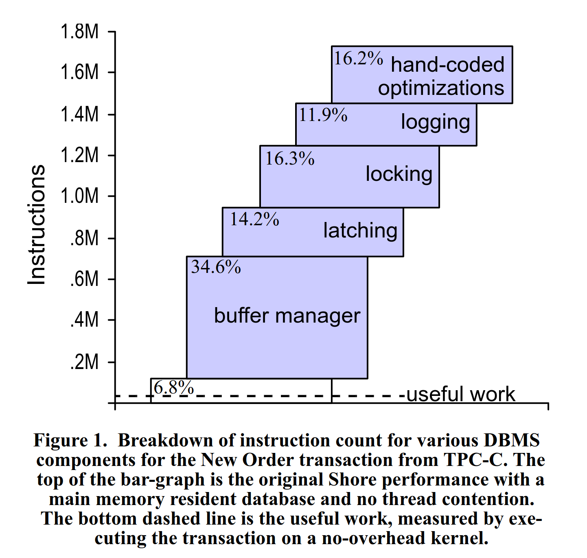
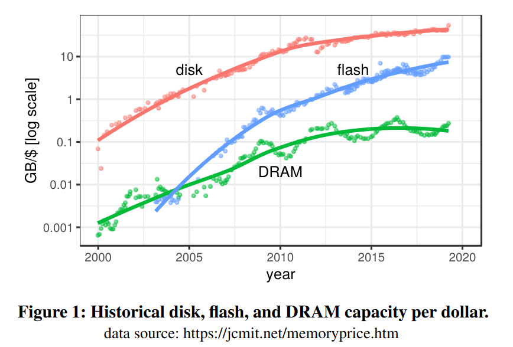

"640K ought to be enough for anybody." - Bill Gates claims to have never actually said that. 640KB is definitely not enough to hold most data sets in memory. That’s why the assumption made in old database systems is that you have to access the disk for basically every operation. Since HDDs were essentially the only available storage medium for databases at the time (other than tape), the cost of I/O accesses dominated database performance. The cost decrease and capacity increase of RAM and the advent of flash storage introduced new opportunities for database systems. Let’s explore the different storage options.

# Time for a complete rewrite?

Traditionally, from the 70s to the early 2000s, RAM was expensive and scarce. Disk was cheap and plentiful. That all changed when RAM sizes became large enough to realistically fit a lot of real-world datasets in memory for a price that wasn't astronomical. Stonebraker famously wrote a paper called ["The End of an Architectural Era (It’s Time for a Complete Rewrite)"](https://www.vldb.org/conf/2007/papers/industrial/p1150-stonebraker.pdf) in 2007 that argued that the traditional database architecture was unable to fully utilize the capabilities of modern hardware with large RAM and that we should move to a new architecture that was fully in-memory.

Until recently, it was conventional wisdom in the database world that you had to go fully in-memory for data processing if you wanted to achieve high performance, even if that meant that you also had to pay the price of the RAM for having all of your cold data in memory too.

# The traditional tradeoff

Disk-based databases are known to be cheaper to operate because they don’t require the entire dataset to fit into RAM. In-memory systems, on the other hand, are known to be extremely fast because RAM has much higher bandwidth and much lower latency than disk. The difference is huge, especially when compared against a spinning disk (HDD). We’re talking ~100,000x difference in latency and a ~200x difference in bandwidth (although that can be minimized by putting multiple disks into a RAID array). Therefore, the only thing that mattered traditionally was minimizing the disk I/O. Even after optimizing that, the disk still usually dominated performance.

Disks are insanely cheap. You can get a TB of HDD for 10-20€ nowadays. RAM is still expensive. A TB of server-grade ECC DDR4 RAM is gonna set you back 1-2000€. That’s a factor of 100x difference in price. So if you have a 10TB dataset, you’re looking at 100-200€ for the HDD and 10-20k€ for the RAM.

That price is certainly acceptable for high value-per-gigabyte datasets like in ERP systems, which usually contain the most important data a company has. This is also why SAP developed SAP HANA as an in-memory database system for its newest S/4HANA ERP system. It allows for incredibly fast analytics on live business data. If the management of a car company wants to know the most popular color per country, they can get that information on demand in seconds.

Sadly, database developers' dreams and expectations of eventually having huge RAM sizes for very low prices in every computer didn't come true. As you have probably noticed, your Laptop most likely doesn't have 10TB of RAM in it. RAM prices and sizes have been almost stagnant for a while now. This is a problem since most data sets will include a relatively small "hot set", usually less than 10% of the data used by almost all queries, and a very large cold set, usually older data, that is rarely touched. Therefore you will be paying a lot of additional RAM just to hold the 90% cold data at very little performance benefit. Thinking about the car company again, this is also logical since no new invoices for the year 2014 will be created or modified anymore, and management usually won’t be interested in what the most profitable model was 10 years ago. In an In-Memory system, this would mean you need 10x more memory than you would need if you only stored the hot set in memory. This isn't possible for traditional in-memory systems, though, because part of the reason they are so fast is that they could throw out buffer management that causes quite a bit of overhead.

In their paper "OLTP through the looking glass, and what we found there", Harizopoulos et al. profiled a TPC-C OLTP workload and found that only a low single-digit percentage of the CPU instructions executed were actually useful work for processing the query. More than 30% of the instructions were spent in the buffer manager in this example:

*Plot from  Harizopoulos et al. "OLTP through the looking glass, and what we found there"*

# The new kid on the block

In the last few years, a new type of storage has become popular: flash storage or SSDs. The advent and popularity of smartphones also lead to very significant decreases in the prices of SSDs. This also sparked the interest of the database research community. While SSDs, of course, greatly speed up traditional disk-based database systems, those can’t really take advantage of them fully. Especially when putting a few of them together into a RAID array, you can achieve extremely impressive performance numbers. Using 8 × 3.8 TB Samsung PM1733 SSDs, one can theoretically achieve up to 12.5 million random I/O read operations per second which results in a read bandwidth of 50 GB/s. This is actually memory bandwidth territory (CPU <-> RAM).

*Plot from Haas et al.: "Exploiting Directly-Attached NVMe Arrays in DBMS"*

Gabriel Haas (TUM) showed that even modern storage engines like LeanStore or RocksDB fail to utilize the I/O capability of such a setup by at least 3.5x (["What Modern NVMe Storage Can Do, And How To Exploit It: High-Performance I/O for High-Performance Storage Engines"](https://www.vldb.org/pvldb/vol16/p2090-haas.pdf)).

SSDs also lead database researchers to reconsider whether fully in-memory is the best choice for high-performance database systems. With SSDs' capabilities, it should be possible, at least in theory, to build a system that is much cheaper to operate than a pure in-memory system while achieving almost the same performance.

# Conclusion

As we saw, there is a reason for the renewed interest in disk-based database systems. Reduced cost and increased performance of modern hardware have significantly changed the equation. Pure in-memory systems are at a disadvantage compared to in-memory optimized SSD-based systems like [Umbra](https://umbra-db.com) because they are too expensive to operate. 

As you now know, SSDs are a real alternative to pure in-memory processing in many cases. Utilizing this without losing the performance benefits of in-memory systems is an additional challenge for database system developers. In a future blog post, I’m going to describe ways to achieve this at the buffer management level. Stay tuned!
