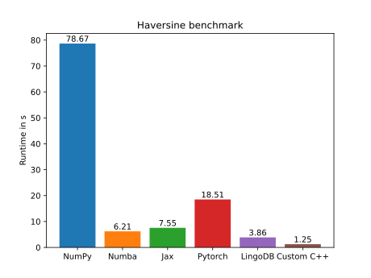

Over the past 12 years, [Just In Time Compilation for SQL query plans](https://dl.acm.org/doi/10.14778/2002938.2002940) (pioneered by Thomas Neumann at TUM) gained popularity when it comes to developing high-performance analytical database management systems. The main idea sounds simple: the system generates specialized code for an individual query and avoids the overhead of interpretation of traditional query engines.

[LingoDB](https://www.lingo-db.com/), a new research project from [Michael Jungmair](https://db.in.tum.de/~jungmair/) at TUM, aims to enhance the flexibility and extensibility of this approach drastically. It pursues this goal in two ways:

1.  Declarative Suboperators allow users to create their own operations within LingoDB beyond traditional relational algebra allowing the application of the data processing engine of LingoDB to other domains
2.  Building upon multi-level intermediate representation (MLIR), a compiler framework that allows cross-optimization between independently implemented domains. For instance, any User Defined Function (UDF) that can be expressed by an MLIR dialect, such as for instance a PyTorch machine learning model, can be seamlessly integrated into LingoDB. Optimization passes at lower levels can optimize not only both dialects individually but can do additional optimizations based on their interaction.

In general, there has been a recent trend to move computations from applications into the database. This has the advantage of eliminating costly data transfers between the application and the database, which are usually in separate processes if not even servers. However, external code is often treated as a black box by the database, resulting in poor performance. LingoDB’s approach promises new ways for users to express the code they want to move into the database as well as performance that is as good as native database functions.

# Application to Numerical workloads

To show the suboperators' flexibility, the [latest paper](https://dl.acm.org/doi/10.14778/3611479.3611539) includes a few examples, e.g., a comparison of LingoDB with [NumPy](https://numpy.org/) for numerical workloads such as the computation of the haversine distance (the distance on a sphere). To compare the performance, a benchmark which calculates the haversien distance between approximately 500 million pairs of points is considered.

<math xmlns="http://www.w3.org/1998/Math/MathML" display="block" class="tml-display" style="display:block math;">
  <mtable displaystyle="true" columnalign="right">
    <mtr>
      <mtd class="tml-right" style="padding:0.7ex 0em 0.7ex 0em;">
        <mrow>
          <mn>2</mn>
          <mo>⋅</mo>
          <mrow>
            <mi>arcsin</mi>
            <mo>⁡</mo>
          </mrow>
          <mrow>
            <mo fence="true" form="prefix">(</mo>
            <msqrt>
              <mrow>
                <msup>
                  <mi>sin</mi>
                  <mn>2</mn>
                </msup>
                <mo>⁡</mo>
                <mspace width="0.1667em"></mspace>
                <mrow>
                  <mrow>
                    <mo fence="true" form="prefix">(</mo>
                    <mfrac>
                      <mrow>
                        <msub>
                          <mi>ϕ</mi>
                          <mn>2</mn>
                        </msub>
                        <mo>−</mo>
                        <msub>
                          <mi>ϕ</mi>
                          <mn>1</mn>
                        </msub>
                      </mrow>
                      <mn>2</mn>
                    </mfrac>
                    <mo fence="true" form="postfix">)</mo>
                  </mrow>
                  <mo>+</mo>
                  <mrow>
                    <mi>cos</mi>
                    <mo>⁡</mo>
                    <mspace width="0.1667em"></mspace>
                  </mrow>
                  <msub>
                    <mi>ϕ</mi>
                    <mn>1</mn>
                  </msub>
                  <mo>⋅</mo>
                  <mrow>
                    <mi>cos</mi>
                    <mo>⁡</mo>
                    <mspace width="0.1667em"></mspace>
                  </mrow>
                  <msub>
                    <mi>ϕ</mi>
                    <mn>2</mn>
                  </msub>
                  <mo>⋅</mo>
                  <msup>
                    <mi>sin</mi>
                    <mn>2</mn>
                  </msup>
                  <mo>⁡</mo>
                  <mspace width="0.1667em"></mspace>
                  <mrow>
                    <mo fence="true" form="prefix">(</mo>
                    <mfrac>
                      <mrow>
                        <msub>
                          <mi>λ</mi>
                          <mn>2</mn>
                        </msub>
                        <mo>−</mo>
                        <msub>
                          <mi>λ</mi>
                          <mn>1</mn>
                        </msub>
                      </mrow>
                      <mn>2</mn>
                    </mfrac>
                    <mo fence="true" form="postfix">)</mo>
                  </mrow>
                </mrow>
              </mrow>
            </msqrt>
            <mo fence="true" form="postfix">)</mo>
          </mrow>
        </mrow>
      </mtd>
    </mtr>
  </mtable>
</math>

Haversine formula for the unit sphere

To our surprise, LingoDB vastly outperformed NumPy despite not being optimized for such workloads. This article will explore how this is the case and recreate the benchmark with a few additional frameworks not considered in the paper.

NumPy achieves its performance by using a vectorized execution model. Using SIMD (Single Instruction Multiple Data), it can operate on multiple values at once. NumPy executes one mathematical operation at a time, meaning it needs to materialize individual results after each operation. In the haversine example, this leads to a total of 10 materializations.

LingoDB does not support vectorized execution, however its compilation allows to compute all operations for a single value before starting computations for the next value. This eliminates intermediate materializations and allows to keep the computed value in a CPU register throughout the entire computation. Additionally, LingoDB can automatically parallelize its workload, resulting in a speedup relative to the number of threads. Compilation does come with a cost, namely the latency of just-in-time compilation. For the considered benchmark, this is around 90ms.

# Benchmark results

Benchmark Results on Intel(R) Xeon(R) CPU X7560  @ 2.27GHz with 32 Cores

The data science community has also recognized the benefits of just-in-time compilation and developed its own frameworks, such as [Numba](https://numba.pydata.org/) and [Jax](https://jax.readthedocs.io/en/latest/index.html), which allow to write JIT compiling code in a NumPy-like fashion. Both frameworks manage significant speedup and reduce execution time by an order of magnitude. Still, neither framework manages to reach the same performance as LingoDB with Jax taking almost twice as long.

Additionally, we also consider [PyTorch](https://pytorch.org/). While it is designed for deep learning, the underlying operations are the same as in our haversine computation. However it shows that PyTorch is optimized for GPU rather than CPU as its performance lacks behind other competitors and only manages to beat NumPy.

Since vectorization and JIT compilation are orthogonal concepts, they can be combined. Since we are not aware of a functional library that supports both, we include a handwritten, multi-threaded C++ program to show the attainable runtime performance. The program was compiled with g++ and O3 to enable all optimization passes (including vectorization).

Indeed all considered frameworks have room for improvement as the runtime of the specialized C++ program is around 3 times faster than LingoDB. Note that the displayed time for the handwritten C++ program does not include compile time while JIT compilation times are included.

# Conclusion

The results of the benchmark clearly show the importance of just-in-time compilation for modern data analytics workloads since all the top-performing competitors use this approach. Due to the complexity of implementing code generation, there is an interest in using a common runtime to encapsulate much of the complexity for multiple libraries/use cases. LingoDB could be used for this purpose and supports cross-optimizations with other domains by building on the MLIR framework. LingoDB as a database has the additional advantage of controlling the data, eliminating costly data format conversions, and allowing for reduction of the amount of data transferred between processes by directly executing computations (and possibly filtering based on the results) in the database.