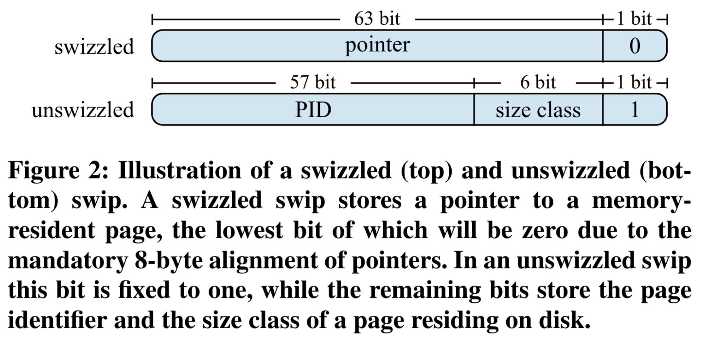
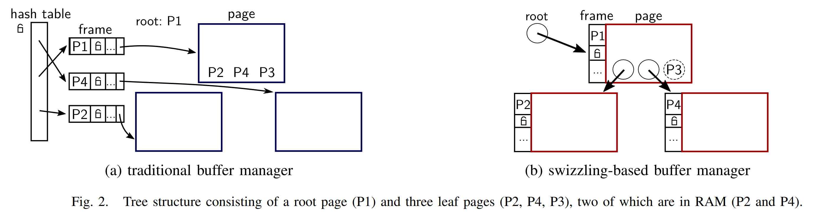

In the [first part]() of this series about modern database storage we have already seen how SSDs have been becoming the go-to base storage for modern database systems more and more in the late 2010s and especially now. As long as most of the data that most of your queries are touching fits into main memory, SSDs can easily handle the rest at a very small performance cost.

# The approaches

There are multiple approaches to achieving in-memory speeds for in-memory cases and utilizing the SSD well in out-of-memory cases relying on fast NVMe SSDs. To understand what characteristics those approaches need, we must first understand the problem with traditional buffer management. After that, we will present some potential solutions to this problem. This will be split up between this post and another one coming soon.

## Traditional buffer management

What does a buffer manager actually do? It maps page ids to buffer frames (memory region reserved for a page) in some way and makes sure to evict pages to make space for new pages if it is full. Ok. That doesn't sound so difficult, does it? Well, the whole thing becomes interesting when we throw in multi-threading which is absolutely mandatory for high-performance systems nowadays. 

Traditionally, hash tables are used for this mapping. However, compared to dereferencing a simple pointer, a hash table lookup is very expensive, even when using an optimized hash table. It usually also involves taking some kind of lock (and hopefully getting it without having to wait) for the page table, and then you still have to dereference a pointer that the page table gives you. 

A basic code for a page id dereference (single-threaded) would look something like this:

```c++
Page* fix_page(uint64_t page_id) {
    if(page_table.contains(page_id)) {
        return page_table[page_id];
    } else {
        Page* page = evict_page();
        load_from_disk(page_id, page);
        page_table[page_id] = page;
        return page;
    }
}
```


Another problem is that traditional buffer managers force you to use a single page size for all pages. The problem is that users can usually input stuff with arbitrary length. You don't want to give your user an error just because they input a 2MB string. There's only two ways to solve this. Either you have another layer of indirection (always solves any problem in computer science) for large values (like Postgres TOAST) which you have to check for every value you read or you have some kind of overflow pages which essentially also result in another indirection and a lot of complexity when implementing your data structures.

## Non-solutions

So we want to map memory regions to disk regions, right? Isn't there a very nice way to let the operating system do this for us? MMAP might come to your mind but beware! Even though a small group of hardcore LMDB fans will keep arguing in its favor it has been shown (["Are You Sure You Want to Use MMAP in Your Database Management System?"](https://db.cs.cmu.edu/mmap-cidr2022/)) that MMAP actually has tons of problems. For read only workloads it's actually fine but those are kind of boring. As soon as we start writing it already becomes worse and when throwing in multi-threading you get what looks like a flat line at 0 compared to properly built systems.

## Pointer Swizzling

The technique of pointer swizzling is not new, however it is only being used for buffer management in database systems rather recently. Legendary database researcher Goetz Graefe has published a paper in 2014 with other researchers from HP Labs and Google that describes how to do this (["In-Memory Performance for Big Data"](https://research.google/pubs/in-memory-performance-for-big-data/)).

The general idea of pointer swizzling is to kind of cheat extra information into pointers and check that before dereferencing them. How this usually works is that there is a single bit that decides whether you have an actual pointer that you can just dereference or whether you have to load something from disk. Usually either the first or the last bit will be used for this. Those will always be 0 in real pointers because of address sizes (which even though your programming languages will claim they are 64 bits are actually only 48 bits on older and 57 bits on newer machines using 5 level paging) in the case of the first bit and because of alignment to 4 kB virtual memory pages in the case of the last bit.

In case you have a real or "swizzled" (therefore the name of the technique) pointer (which is always true for the in-memory case) your only overhead over a pure in memory solution is the single bit check in your pointer. This is obviously a branching operation which can lead to significant costs in performance but as long as the case that the page you want to read is in memory is very likely the branch predictor of your CPU should do a good job of predicting this branch correctly thereby minimizing the cost of this operation.

So now that we have shown that the in-memory case will have almost the same speed as a pure in-memory solution what about the page fault case. Well then the pointer is "unswizzled" and will not actually contain any valid memory address. What it will actually contain is some kind of page id. This page id can then be loaded into memory (after possibly evicting another page and swizzling its pointer) and the pointer can be swizzled. So the cost of that is not really that high either. Notable Systems doing this are the Shore-MT system that the initial research by Graefe et al. was done on, WiredTiger (MongoDBs new storage engine), [Lean Store](https://db.in.tum.de/~leis/papers/leanstore.pdf) (Prof. Leis et al.) and [Umbra](https://www.cidrdb.org/cidr2020/papers/p29-neumann-cidr20.pdf) (Prof. Neumann et al.) which has a quite advanced buffer manager based on Lean Store that can even support variable page sizes to avoid the problem with large tuples mentioned before.


*Illustration from Neuman and Freitag: "Umbra: A Disk-Based System with In-Memory Performance"*

A basic code for a page id dereference (single threaded) would look something like this:

```c++
Page* fix_page(PageSwip page_swip) {
    if(page_swip.is_unswizzled()) {
        Page* page = evict_page();
        load_from_disk(page_swip.get_page_id(), page);
        page_swip.swizzle(page);
        return page;
    } else {
        return page_swip.get_ptr();
    }
}
```

### Problems

Well ok, sounds good, right? Does this mean in-memory optimized buffer management is a solved problem? Well... Not quite! There are also some problems associated with it. 

First of all, as you might have noticed, suddenly your buffer management strategy kind of leaks into every part of your database system. Also there are some parts we have only glanced over, most notably eviction. Because when you’re evicting a page, you have to unswizzle the pointer pointing to it, which is usually located on a different page. This also means that there can only ever be one pointer to every page (or at least only a small fixed number). This however means that implementing general graph based data structures becomes impossible and you're essentially limited to using some kind of tree-datastructure. Since B-Trees are still a good data structure, even for in-memory cases, this is not the worst thing in the world but there are also other nasty details with the real world implementation like concurrency becoming harder in implementation and eviction also becoming tightly coupled to pointer swizzling. So from a Software Engineering perspective this is not an ideal solution.


*Illustration from Leis et al.: "LeanStore: In-Memory Data Management
Beyond Main Memory"*

# Conclusion

As we have seen now, traditional buffer management strategies are not gonna cut it. Pointer swizzling is a very performant approach but it is not the most elegant solution from a practical perspective. Other things like optimistic latching are also an important factor. 

If you want to learn more we encourage you to read the original LeanStore and Umbra papers or to watch Prof. Viktor Leis (TUM) present LeanStore in [CMUs 2021 Database Talk Series](https://www.youtube.com/watch?v=o467OKy7Q0g) which also explains details like eviction in more detail.

In the next part of this series we will be describing how VMCache can help achieving similar performance with a much nicer API that is basically like that of a traditional buffer manager.
