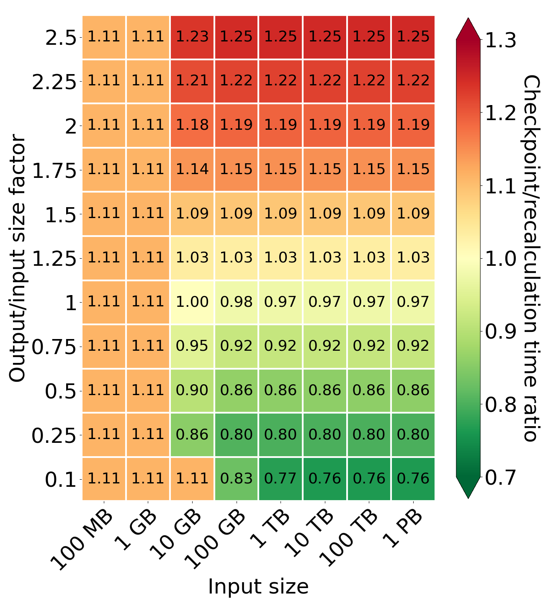
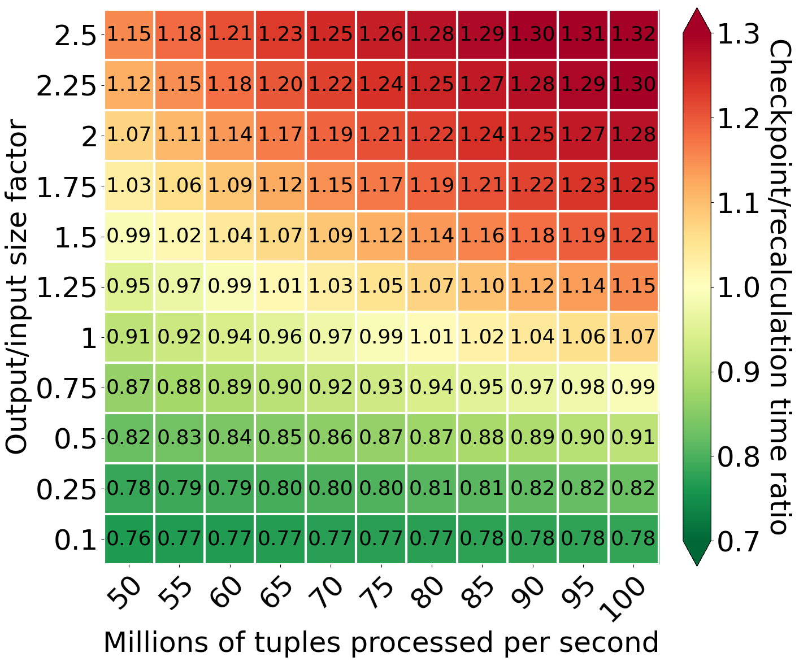
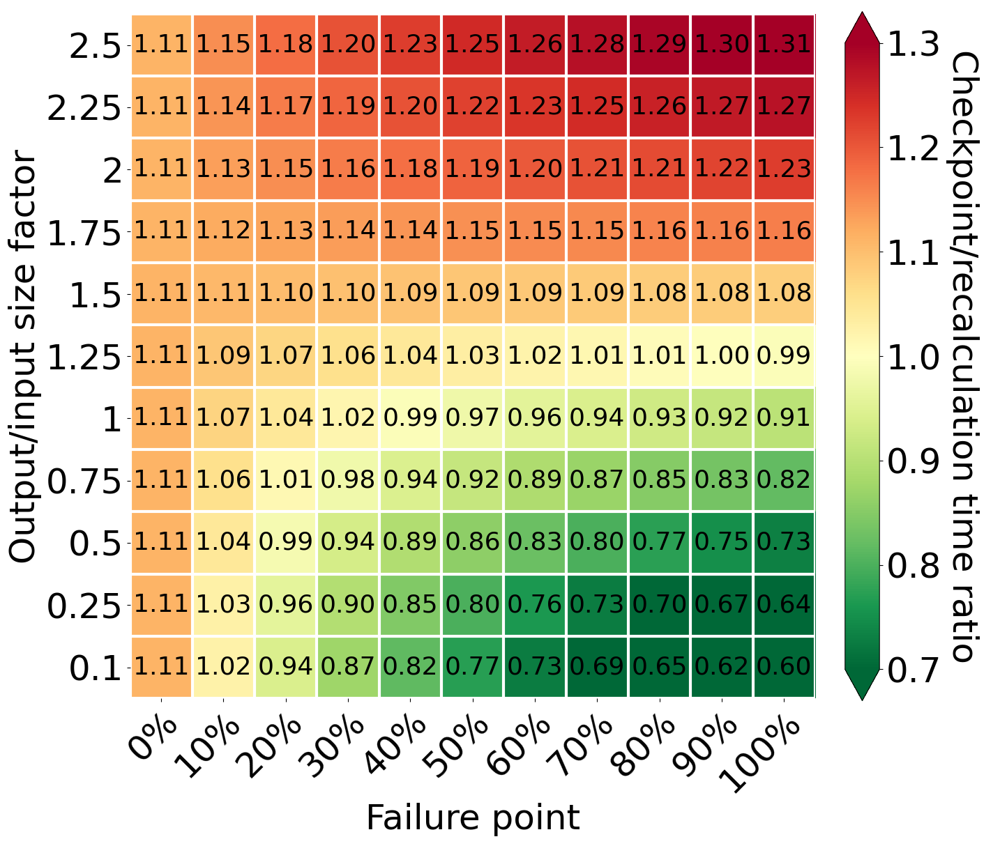

# Introduction

The cloud is one of the most impactful innovations in recent years. More and more companies are moving to the cloud instead of using on-premise servers. As a consequence, the amount of data processed in the cloud increases. For these reasons, new services for query execution are developed, e.g., Snowflake, Amazon Redshift, and Google BigQuery. However, the cloud is built on unreliable hardware and failures are common. Consequently, high-performance query processing has to be able to detect such accidents and execute self-healing operations to hide them from customers in order to provide high-quality service. Additionally, hardware failures are not the only reason for stopping and resuming processing on another machine. The other examples are spot-instance interruptions and scaling up.

To deal with these common failures, we need self-healing methods to resume computation on new machines. There are two basic self-healing methods. The first is starting computation from the beginning and recomputing all previous (intermediate) results again. It is simple and does not require any additional operation during processing. However, it may significantly lengthen the OLAP processing, which might even have been running for hours before a failure. The second self-healing method is checkpointing. In this scenario, a worker creates checkpoints and saves them in durable storage like S3 during processing. When a failure occurs and the system starts a new instance, the new worker reads checkpoint data and restarts processing from the last saved point. However, creating and saving checkpoints requires additional computation power and network transfer. Consequently, if there is no failure, the processing time while using checkpoints is longer than when using recomputation. This also leads to a higher cost because, in the cloud, we pay for processing time.

The most common way of handling failure is restarting computation from the beginning. However, efficient checkpointing is also an area of intensive research. Checkpointing is an interesting area for researchers because, without its overhead, it could provide significantly shorter execution times when failures occur. In this series, we will focus on comparing both methods. In the first part, we will describe time models for both approaches. In the second part, we will create cost models based on them. Finally, in the third part, we will focus on building systems based on the previous models to explore how both methods work with low and high-probability failure.

# Recomputation time model

Modeling processing time for a system using recomputation is simple and is only dependent on the three parameters:
- **Input size** - the size of the input,
- **Processing speed** - tuples processed per second, assuming one tuple size equals 100B,
- **Failure point** - a number between 0 and 1 describing part of processing done before the failure occurred; if it equals 0, it means no failure.
We can define the whole model using a straightforward equation:

<math display="block" class="tml-display" style="display:block math;">
  <mrow>
    <msub>
      <mi>t</mi>
      <mi>r</mi>
    </msub>
    <mo>=</mo>
    <mfrac>
      <mrow>
        <mi>i</mi>
        <mi>n</mi>
        <mi>p</mi>
        <mi>u</mi>
        <mi>t</mi>
        <mi>S</mi>
        <mi>i</mi>
        <mi>z</mi>
        <mi>e</mi>
      </mrow>
      <mrow>
        <mi>p</mi>
        <mi>r</mi>
        <mi>c</mi>
        <mi>o</mi>
        <mi>e</mi>
        <mi>s</mi>
        <mi>s</mi>
        <mi>i</mi>
        <mi>n</mi>
        <mi>g</mi>
        <mi>S</mi>
        <mi>p</mi>
        <mi>e</mi>
        <mi>e</mi>
        <mi>d</mi>
      </mrow>
    </mfrac>
    <mo>*</mo>
    <mo form="prefix" stretchy="false">(</mo>
    <mn>1</mn>
    <mo>+</mo>
    <mi>f</mi>
    <mi>a</mi>
    <mi>i</mi>
    <mi>l</mi>
    <mi>u</mi>
    <mi>r</mi>
    <mi>e</mi>
    <mi>P</mi>
    <mi>o</mi>
    <mi>i</mi>
    <mi>n</mi>
    <mi>t</mi>
    <mo form="postfix" stretchy="false">)</mo>
  </mrow>
</math>

# Checkpointing time model

We base our checkpointing processing time model on the solution introduced in [PhoeniQ](https://www.jstage.jst.go.jp/article/transinf/E105.D/5/E105.D_2021DAP0004/_article)- package-level checkpointing. We group tuples into packages and add a marker tuple indicating the end of each package. The checkpointing is much more complicated and, in consequence, dependent on more parameters than recomputing:
- **Input size** -  the size of the input,
- **Processing speed** - tuples processed per second, assuming one tuple size equals 100B (in the case of utilizing all cores for processing),
- **Output/input factor** - the proportion between output and input size; if below 1, it means that output size is smaller than input size,
- **Network connection** - the network throughput of uploading checkpoints and downloading them after a failure,
- **Checkpoint file size** - the size of the files saved in S3 as checkpoint data; data contains output data and marker tuples indicating which tuples were saved.
- **CPU overhead for data transfer** - the loss of the processing speed because of using some of the cores for transferring data,
- **Failure point** - a number between 0 and 1 describing part of processing done before the failure occurred; if it equals 0, it means no failure.

The whole processing time can be described as a sum of three time intervals:

<math display="block" class="tml-display" style="display:block math;">
  <mrow>
    <msub>
      <mi>t</mi>
      <mi>c</mi>
    </msub>
    <mo>=</mo>
    <mi>p</mi>
    <mi>r</mi>
    <mi>o</mi>
    <mi>c</mi>
    <mi>e</mi>
    <mi>s</mi>
    <mi>s</mi>
    <mi>i</mi>
    <mi>n</mi>
    <mi>g</mi>
    <mi>T</mi>
    <mi>i</mi>
    <mi>m</mi>
    <mi>e</mi>
    <mo>+</mo>
    <mi>l</mi>
    <mi>o</mi>
    <mi>s</mi>
    <mi>t</mi>
    <mi>D</mi>
    <mi>a</mi>
    <mi>t</mi>
    <mi>a</mi>
    <mi>R</mi>
    <mi>e</mi>
    <mi>c</mi>
    <mi>o</mi>
    <mi>m</mi>
    <mi>p</mi>
    <mi>u</mi>
    <mi>t</mi>
    <mi>a</mi>
    <mi>t</mi>
    <mi>i</mi>
    <mi>o</mi>
    <mi>n</mi>
    <mi>T</mi>
    <mi>i</mi>
    <mi>m</mi>
    <mi>e</mi>
    <mo>+</mo>
    <mi>d</mi>
    <mi>o</mi>
    <mi>w</mi>
    <mi>n</mi>
    <mi>l</mi>
    <mi>o</mi>
    <mi>a</mi>
    <mi>d</mi>
    <mi>C</mi>
    <mi>h</mi>
    <mi>e</mi>
    <mi>c</mi>
    <mi>k</mi>
    <mi>p</mi>
    <mi>o</mi>
    <mi>i</mi>
    <mi>n</mi>
    <mi>t</mi>
    <mi>T</mi>
    <mi>i</mi>
    <mi>m</mi>
    <mi>e</mi>
  </mrow>
</math>

Processing time depends not only on the number of input tuples and processing speed but also on CPU overhead for data transfer. Some of the CPU's cores need to be used for transferring data, so they cannot be used for processing. For example, if we have 64 cores and 8 of them are used for transfer, the overhead equals 12.5%. Additionally, we also need to process inputSize/packageSize marker tuples. In our case, packageSize equals 4096, as was proposed in PhoeniQ's paper.

The second factor is recomputing lost results. If the amount of data generated until the failure is lower than the amount of data possible to transfer by the network, we only need to recompute data in the uncompleted checkpoint file. In consequence, the smaller the checkpoint file, the less data to recompute in the case of failure. However, if the network transfer speed is insufficient to save all data on the fly, we must recompute all complete checkpoint files that were not saved in S3. In this case, the number of recomputed data increases with the greater failure point because of a growing queue of files to transfer.

The last factor is the time required to download checkpoint files after the failure. It depends not only on the network connection throughput but also on how much data was generated before a failure.

# Comparison

Now, we will compare these two models. We will investigate the influence of the most essential parameters on queries with different output/input size factors. While comparing the models, assume the following default values if not specified:
- Input size - 1 TB
- Tuples processed per second - 70M
- Part of CPU delegated for transfer - 10%
- Transfer speed - 10 GB/s
- Checkpoint file size - 1024 MB
- Failure point - 50%

*Comparison of processing time for different values of output/input size factor and input size*

Firstly, we analyze the impact of different input sizes on the processing time. When the generated output is smaller than the checkpoint file size, we can see that the recomputation results in a smaller processing time. It is caused by the fact that the system using checkpoints has to process additional marker tuples during processing and the assumption that some of the cores are delegated only to save checkpoint files in S3. When we increase the amount of generated data, the system creates checkpoints before failure at 50% of the processing. From this point forward, the smaller the output/input factor for larger input sizes, the more significant the difference between the amount of data to download after a failure by the checkpointing and recomputation models. This causes checkpointing to be more profitable. The break-even point is the output/input factor equal to 1 (for a network equal to 10 GB/s). If the output/input factor is greater than 1, we have to read more data than before, which makes recomputation more profitable.

*Comparison of processing time for different values of output/input size factor and processing speed*

The other crucial parameter is processing speed. For compute-intensive operations, if there is a failure in the middle of the processing, it is profitable to make checkpoints even for output/input size factor values like 1.5. Moreover, the smaller the generated output, the more profitable it is to use checkpointing compared to recomputation. At the same time, increasing the processing speed reduces both models' processing time, but it also reduces the gap between checkpointing and recomputation. This is because the system using checkpointing has to download checkpoints before starting processing again. If reprocessing is faster than downloading, the gap between checkpointing and recomputing becomes smaller. Eventually, there is no gap, and we can observe that recomputation is more profitable even for output/input size factors below 1.

*Comparison of processing time for different values of output/input size factor and failure point*

The failure can occur at any moment of the processing, and because of that, we have to consider the efficiency of both methods in the context of different failure points. The first column with a failure point equal to 0% shows the most common case - no failure. In this situation, the checkpointing is slower by 11% than recomputation using our model and assumptions. This is caused by processing additional marker tuples and the assumption that some of the cores are delegated to save checkpoint files in S3. While checkpointing, the system performs additional operations that should pay for itself during a failure. However, if there is no failure, there is no possibility that checkpointing is faster than recomputing. Additionally, for the output/input factors greater than 1, the difference in time between both methods increases in recomputation's favor if failure occurs later. This is caused by generating more data than the network can transfer. As a result, the system has to recreate them after a failure, despite using checkpointing. Besides, it has to download checkpoints, which are larger than the input data. However, we can observe the opposite situation for small output/input size factors. The amount of generated data is smaller than the input data and it is possible to save all of it in S3. Thanks to that, the system has to recompute only a tiny part of it - only from an incomplete checkpoint file. Moreover, the checkpoint is smaller than the input data, so it requires less time than downloading checkpoint files.

# Conclusions

In this part, we defined the time models for both self-healing methods and analyzed the impact of some parameters. As we can observe, the checkpointing is very promising in the case of failure. It can lead to significantly shorter processing for large queries with small output. However, whether a gain occurs or not depends on many different parameters. In the next part, we will compare both methods from a cost perspective, as the cost is one of the most critical factors in the cloud.

The next part is already available: [Part 2. Cost Model]()