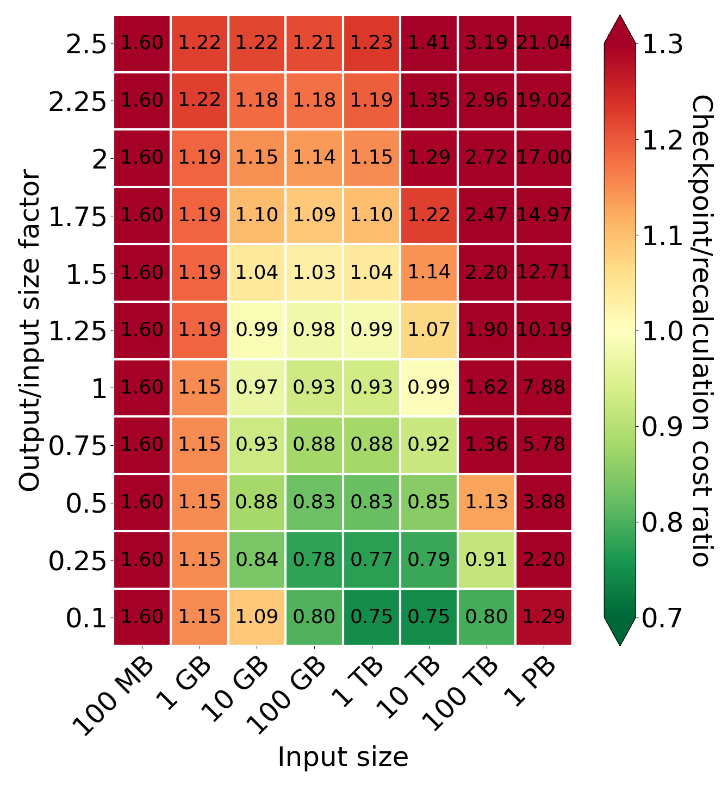
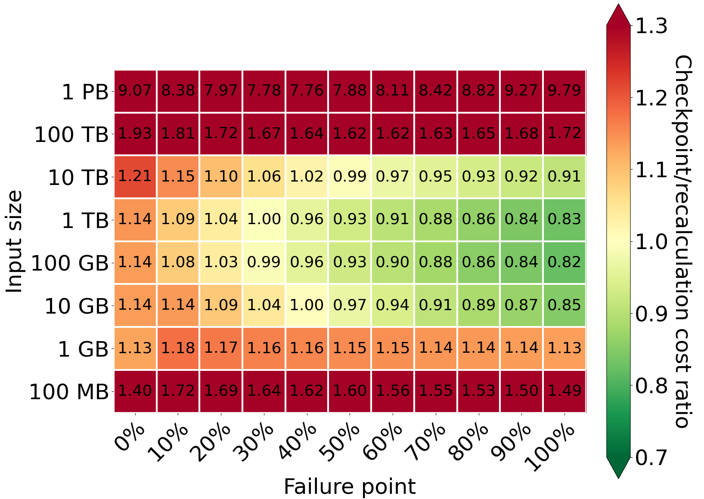
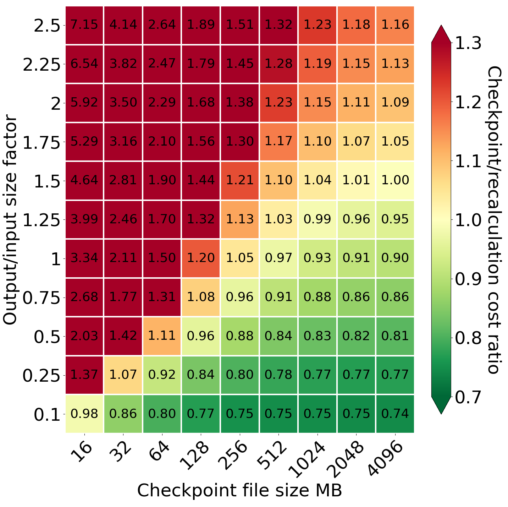
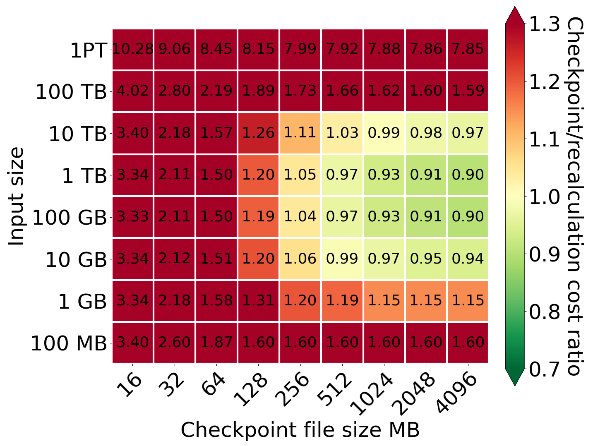

# Introduction

In [the previous part](), we focused on creating time models for two self-healing methods - recomputation and checkpointing. We have stated that the recomputation model can be described using the following parameters:
- Input size
- Processing speed
- Failure point

The checkpointing model required the following additional parameters:
- Output/input factor
- Network connection
- Checkpoint file size
- CPU overhead for data transfer

However, we can often achieve close to 0 processing times in the cloud using scaling. Nevertheless, it can generate a high cost and be unreasonable from the maintenance perspective. For this reason, we should always consider the performance in the context of the price and find a reasonable trade-off.

As AWS is the most popular cloud provider, we will use it in our cost analysis. In query processing, we must pay for two essential services from AWS: EC2 and S3. In the case of EC2, we based our calculation on the c7gn.16xlarge spot instances. Its price oscillates around $1.6 per hour, and we will use that value when computing costs. In the case of S3, we have to pay for each request and the amount of stored data. We assume the following S3 costs during computations:
- **LIST request** - $0.005 per 1000 requests
- **GET request** - $0.0004 per 1000 requests
- **POST request** - $0.005 per 1000 requests
- **DELETE request** - free
- **storing data** - $0.023 per GB per month

Because DELETE requests are free, there is no cost of deleting checkpoints after finishing processing. As in the time models, we assume the tuple size equals 100 bytes and one checkpoint package contains 4096 tuples. Additionally, we assume that files with input data are stored in S3 and each file contains 16MB of data to provide optimal cost-throughput as proposed by [Durner et al](https://www.vldb.org/pvldb/vol16/p2769-durner.pdf) from TUM.

# Recomputation time model

While modeling processing cost with recomputation as the self-healing method, we can specify three basic cost sources:
- **EC2 cost** - the cost of renting EC2 for a time computed according to the previous post,
- **LIST requests to download data** - the cost of listing all available files with input data,
- **GET requests to download data** - the cost of downloading input data to a processing node.

Because we have to compute processing time, the model requires the same parameters described in the time model.
In addition to time computation, we need to calculate the number of AWS accesses (before and after failure) and their total cost, which depends on the input size parameter and the failure point.

# Checkpointing cost model

In the checkpointing cost model, we can specify nine factors that influence the final cost:
- **EC2 cost** - the cost of renting EC2 for a time computed according to the previous post,
- **LIST requests to download data** - the cost of listing all available files with data,
- **GET requests to download data** - the cost of downloading input data to a processing node,
- **POST requests with checkpoints** - the cost of uploading checkpoints to S3,
- **LIST requests to download data to recompute** - the cost of listing files that were processed but not saved in S3,
- **GET requests to download data to recompute** - the cost of downloading files that were processed but not saved in S3,
- **LIST requests to download checkpoints** - the cost of listing checkpoint files,
- **GET requests to download checkpoints** - the cost of downloading checkpoint files,
- **Storage cost** - the cost of storing checkpoint data.

We can group these cost factors into four groups: processing cost, cost of checkpoints, cost of downloading checkpoints, and recomputation cost.

As processing costs, we can include EC2 costs as well as LIST and GET requests sent to download input data. Similarly to the recomputation cost model, first, we have to use the time model and all parameters to compute processing time. Then we need to calculate the number of AWS accesses. However, in the checkpointing model, the system accesses most files only once. For this reason, the number of these requests depends only on the input size.

The cost of checkpoints consists of the cost of POST requests with checkpoint files and their storage costs. These two costs depend on the number of stored files and their size. For this reason, they depend on such parameters as the size of the input, output/input factor, and checkpoint file size.

If the failure occurs, we must include the cost of LIST and GET requests to download the checkpoint files. The number of GET requests is equal to the number of POST requests, so the cost also depends on the size of input, output/input factor, and checkpoint file size.

Additionally, after failure, we need to recompute the part of the results that were in incomplete or unsaved checkpoint files. To recompute all of this lost data, we need to download some of the input files again, so we must pay for extra LIST and GET requests. The number of requests required to recompute data from an incomplete checkpoint file depends on the checkpoint file size and output/input factor. Moreover, if the network is too slow compared to the amount of produced output data, the system cannot transfer all checkpoint files to S3 on the fly. In such a case, we must recompute these unsaved checkpoint files. The number of requests depends on the amount of generated data (processing speed, CPU overhead for data transfer, and output/input factor), network connection throughput, and the queue size with the files ready to send (failure point).

# Comparison

Similarly, as in the case of time models, we will compare different cost model parameters pairwise and analyze their impact on different cost factors. While comparing the models, assume the following default values if not specified:
- Input size - 1 TB
- Tuples processed per second - 70M
- Part of CPU delegated for transfer - 10%
- Transfer speed - 10 GB/s
- Checkpoint file size - 1024 MB
- Failure point - 50%

*Comparison of cost for different values of output/input size factor and input size*

Comparing the relation between the output/input size factor and input size, we can observe the area in which the checkpointing is better than recomputing is smaller than in the analogous plot for the time model. This suggests that checkpointing is better for some queries from a time perspective but not a cost perspective. Based on the plot, recomputing is better for small and huge input sizes. For small query input sizes, it is caused by processing time. Using recomputation offers a smaller processing time and, consequently, a smaller EC2 cost. What is less intuitive is that the recomputation is also better for input equals 1 PT. It is caused by storage costs squarely related to the input size. This is because if the input is 10 times bigger, the system needs 10 times more time to process (and, consequently, store a checkpoint), but a checkpoint will also be 10 times bigger, which in total costs 100 times more. From an output/input size factor perspective, the break-even point is similar to the one in processing time analysis - around 1 and 1.25. Additionally, the smaller the output/input size factor is, the better checkpointing is (if it collects enough data to do checkpoints).

*Comparison of cost for different values of input size and failure point*

When we analyze different failure points, we can observe that the greatest and the earliest gain can be achieved for data between 100GB and 1TB. For 100 GB input, there is a tiny gain from checkpointing, even at a failure at 30% of execution. However, if there is no failure, the checkpointing becomes much more expensive than recomputation. The additional cost of checkpointing is comparable to the gain when a failure occurs at the end of the processing. For 10 TB input, the additional cost is even higher than the gain when a failure occurs at the end of the processing. Here, we present the values for the default value of output/input factor size (equals 1); for smaller values of the factor, the gain is earlier and bigger. However, the additional cost when failure does not happen always remains. Checkpoints are always more expensive because of the cost of creating and storing checkpoints in S3, and EC2 costs are higher due to slower processing.

*Comparison of cost for different values of output/input size factor and checkpoint file size*

While creating a model, we discovered that checkpoint file size is one of the most critical parameters. It cannot be profitable if the system uses the same file size as in the case of storage data (16 MB).  This is caused by the fact that POST requests to S3 are 12.5 times more expensive than GET requests. If the system sends too many POST requests, their cost easily dominates in the total cost; it becomes even bigger than EC2. For this reason, it is essential to decide on the proper checkpoint file size. For a 16 MB checkpoint file, checkpointing provides only a slightly better cost for the factor equal to 0.1. If we increase the checkpoint file size, the system can handle greater output/input size factors and input sizes. Additionally, smaller output/input size factors become more beneficial than before. Finally, for input 1 TB, we achieve a limit at the factor equal to 1.25

*Comparison of cost for different values of input size and checkpoint file size*

From the perspective of different input sizes and constant output/input factor size equal to 1, checkpointing starts to be profitable for a checkpoint file size equal to 512 MB, but 1024 MB still guarantees a noticeable improvement. The even greater files (2048 MB and 4096 MB) are similar but have one disadvantage. Using big checkpoint files causes checkpointing to be performed less frequently, so in the case of failure, the system has to recompute more data, especially for small output/input factors. For these reasons, we used 1024MB as a default checkpointing file size.

# Conclusions

In this part, we focused on creating cost models for self-healing methods. Each parameter defined in the time model affected multiple factors of cost. For this reason, we analyzed the impact of different values of some parameters on the final cost. In many cases, even if the checkpointing is efficient from a time perspective, it is not beneficial from a cost perspective. However, there are queries for which checkpointing provides profits in both aspects. Thanks to that, we can say that checkpoints may be helpful if used carefully. In the next part, we will go into detail about the usefulness of checkpointing, in which we will use models to create systems with different failure probabilities.
