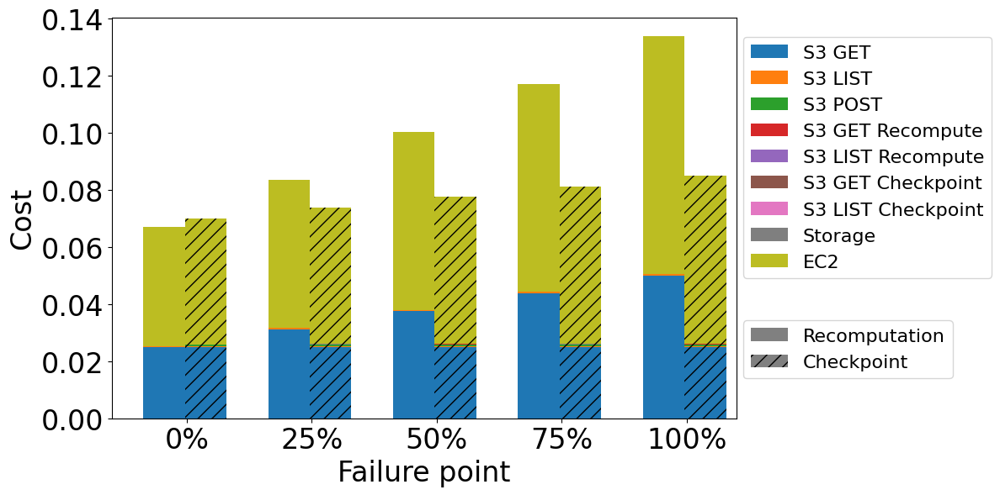
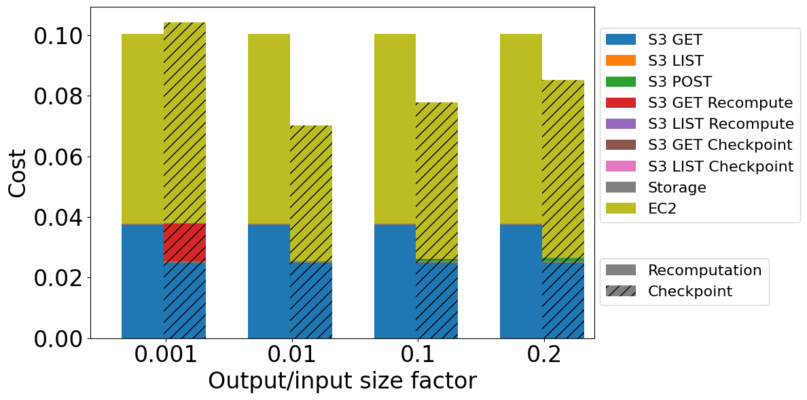
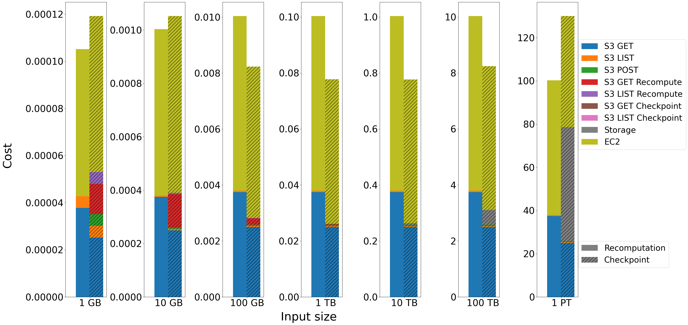
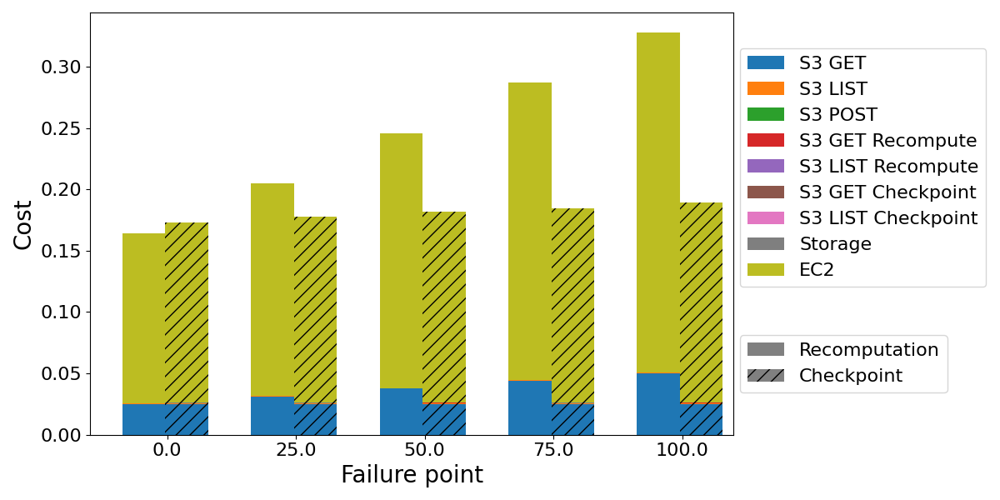
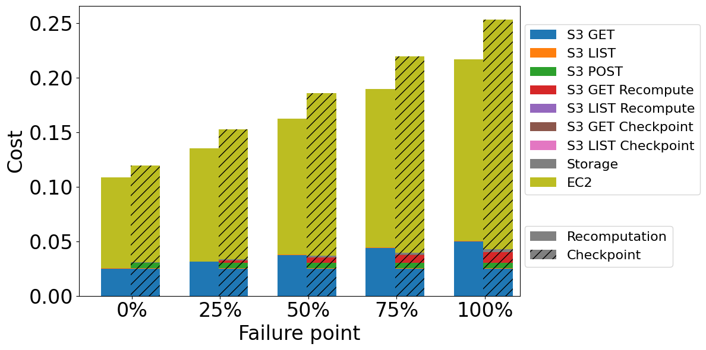
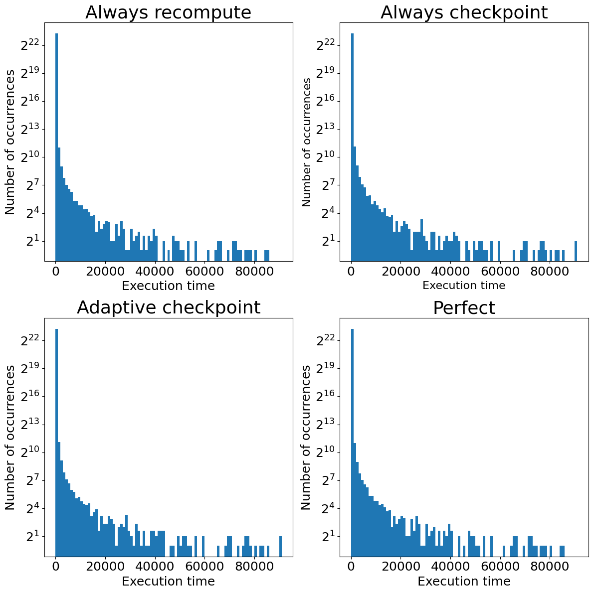
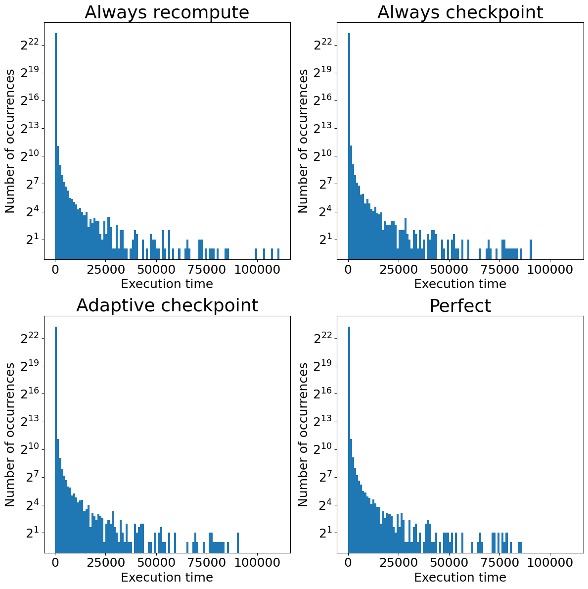

# Introduction

As we analyzed in the previous parts ([part 1]() and [part 2]()), checkpointing can be promising from the perspective of a single query, especially for queries with a low output/input factor. However, the number of parameters makes detailed analysis more difficult. Additionally, we concentrated on cases where a failure occurred. In the actual system, the failures are rare events. For this reason, in this part we will evaluate how both methods would work in systems with different query types, sizes, and failure probabilities.

Firstly, we will assume three types of queries: computation-light aggregation, computation-intensive aggregation, and join. We will analyze the cost structure for each query using different input sizes and output/input size factors. Later, we will analyze the system's behavior while executing these queries with different probability failures. We base the input sizes of the queries on the [Snowset](https://github.com/resource-disaggregation/snowset) - the dataset with information about queries from Snowflake.

During the following analysis, we used the following assumptions:
- The system uses spot instance c7gn.16xlarge (64 cores, 200 Gbit/s ~ 20 GB/s),
- The EC2 instance uses 12 cores for reading input data (10 GB/s) (based on [Durner et.al](https://www.vldb.org/pvldb/vol16/p2769-durner.pdf))
- The checkpointing uses an additional 3 cores for saving checkpoints in S3 (3 GB/s),
- The input is between 1 GB (10,000,000 tuples) and 1 PB (10,000,000,000,000 tuples); the default value is 1 TB,
- Checkpoint file size is equal to 1 GB,
- If a failure point is not specified, it equals 50%.

# Query types

## Computation-light aggregation

The first type of query that we analyze is computation-light aggregation with the following characteristics:

- Compute - Data processed per second: 200 MB/s/core
- Output - Output/input size factor: 0.001 - 0.2

*Cost comparison for computation-light aggregation of different failure points while processing 1 TB of data with output/input size factor equal 0.1*

In the case of both self-healing methods, two dominant cost factors are EC2 and S3 GET requests to get input data.
Other cost factors have a minimal impact. Recomputing is better when there is no failure because of the the checkpointing overhead described in previous parts. When there is a failure, checkpointing is better, even in the early stages of the processing. due to shorter processing (smaller EC2 costs) and fewer GET requests to S3. Additionally, we can observe that the recomputation cost grows much faster than the checkpointing cost. If the failure occurs later, the system has to reprocess and download more input data while using recomputation. On the other hand, while checkpointing, the system has to download only checkpoint files, which number grows slower than the number of files required to reprocess data in recomputation.

*Cost comparison for computation-light aggregation operation of different output/input size factors while processing 1 TB of data with failure at 50%*

When we analyze a different output/input size factor, we can easily see that the best result is for the factor that equals 0.01. For 0.001, we can observe a significant cost from sending S3 GET requests to get data for recomputation. It is caused by too big a checkpoint file size (1 GB) compared to the amount of generated data until 50% of processing. With the greater output/input size factor, the system can save checkpoints more often and use them after a failure, significantly reducing the amount of data needed to recompute. We can observe a cost increase for output/input factors between 0.01 and 0.2. This is mainly caused by the longer processing time (which generates higher EC2 costs) due to downloading more checkpoints. This also connect with a greater number of POST and GET requests to create and access all checkpoints.

*Cost comparison for computation-light aggregation of different input sizes while processing 1 TB of data with output/input size factor equal 0.1 and failure at 50%*

Analysis of the query input size shows results similar to those in the previous blog post.  The checkpointing is reasonable and profitable for inputs greater than 10 GB and smaller than 1 PB. For them, the gain from shorter processing and the smaller number of S3 GET requests is significant and additional costs are negligible. Recomputation is a better method for small inputs (1 and 10 GB). In these cases, the system cannot create checkpoints before a failure at 50%, because the generated output is too small to be saved as a 1024 MB checkpoint file. Additionally, for 1 GB input size, all additional S3 requests connected to checkpointing are relevant factors. Moreover, storage becomes a noticeable cost for input size starting at 100 TB. It is caused by the fact that input size and storage cost are in a square relationship as described in Part 2. For 1 PB, the storage cost is higher than GET requests to S3 for input data and is comparable to EC2 cost, which makes recomputation a cheaper option.

## Computation-intensive aggregation

The second type of query is computation-intensive aggregation.We assume that this aggregation can be characterized with the following properties:
- Compute - Data processed per second: 60 MB/s/core
- Output - Output/input size factor: 0.001 - 0.2

The cost structure and dependencies between different parameters are comparable to light-computation aggregation. The main difference is the greater cost and time caused by the slower processing. In consequence, EC2 cost is about 80% of the total cost, much more than in light-computation aggregation. Additionally, the absolute differences between recomputation and checkpointing are greater. This means that when a failure occurs, the system using checkpointing saves more money. However, this also means that the difference between recomputation and checkpointing when there is no failure is greater than in computation-light aggregation.

*Cost comparison for computation-expensive aggregation of different failure points while processing 1 TB of data with output/input size factor equal 0.1*

# Join

The last type of exemplary query is a query containing joins. We characterize them using the following properties:
- Compute - Data processed per second equals 100 MB/s/core,
- Output - Output/input size factor between 1.0 and 1.5.

*Cost comparison for join operation of different failure points while processing 1 TB of data with output/input size factor equal 1*

For joins, recomputation offers a lower cost and time regardless of whether a failure occurs or not, even if a failure occurs at the end. As in the two previous query types, the dominant cost factor is EC2, so processing time. However, in this case, the processing time while using checkpointing is significantly longer than the processing time while using recomputation. This is caused by the slow network (3 GB/s) and the fact that the system cannot save all data in S3 while checkpointing. Consequently, it has fewer cores to use for processing but cannot save checkpoint files on the fly and, after all, has to recompute them after a failure.

The longer processing is not the only reason for the higher cost. In this case, the size of the checkpoint files is equal to or greater than the size of the input data, which requires more POST requests than in the case of aggregations. In addition, the storage cost also becomes noticeable because of the high output/input size factor and the large amount of generated data.

# Modeling system

To model queries in the system, we randomly choose three parameters for each query: query type, input size, and whether a failure occurred. To model query types, we use the described query examples in proportion: compute-intensive aggregations 45%, computation-light aggregations 45%, and joins 10%. Because of that, most of our queries have a low output/input size factor, which is characteristic of OLAP processing.

The distribution of input sizes is based on the [Snowset](https://github.com/resource-disaggregation/snowset) - a dataset containing information about queries executed in Snowflake. The input sizes in Snowset create a Power Law distribution. Consequently, most queries have a size below 1 GB, for which recomputation is always more beneficial. Due to that, we consider only bigger input sizes and generate random ten million queries from the range 1 GB and 281 TB (2^48 B) based on Snowset distribution

To model different failure cases, we will analyze two opposite cases: a failure is only caused by Spot Instance interruption and a failure is caused by resizing. For each case, we consider four different types of systems: using only recomputation, using only checkpointing, using adaptive checkpointing (checkpoint only if the input is greater than 10 GB and the query is aggregation), perfect (minimal value of recomputation and checkpointing for each query).

## System with only Spot Instance interruptions

Spot instances are cheaper than on-demand instances. For this reason, they are an excellent solution for scaling and using them to execute a single job processing after which the instance is shut down. However, they have one drawback - the cloud provider can interrupt them during high demand for resources. In such a case, the cloud provider sends a signal two minutes before interrupting the machine. Thanks to that, if the processing takes less than two minutes, it can always be finished.

Based on the information on the [Amazon Spot Instance advisor](https://aws.amazon.com/ec2/spot/instance-advisor/), we assume that for c7gn.16xlarge instance, failure probability equals 0 if the processing takes less than 2 minutes and grows linearly over time until it reaches 20% for 30-days processing. As a result, failures are sporadic because the longest processing lasts about 30 hours.
<!DOCTYPE html>
<html>
<head>
  
</head>
<body>
<table>
  <thead>
    <tr>
      <th>Method</th>
      <th>Sum time</th>
      <th>Max time</th>
      <th>Sum cost</th>
      <th>Max cost</th>
    </tr>
  </thead>
  <tbody>
    <tr>
      <th>Recomputing</th>
      <td>641d 14h 26m 15s</td>
      <td>23h 46m 12s</td>
      <td>$30816.76</td>
      <td>$43.75</td>
    </tr>
    <tr>
      <th>Checkpointing</th>
      <td>681d 1h 11m 7s</td>
      <td>1d 1h 13m 53s</td>
      <td>$33421.50</td>
      <td>$79.16</td>
    </tr>
    <tr>
      <th>Adaptive</th>
      <td>666d 15h 42m 25s</td>
      <td>1d 1h 13m 53s</td>
      <td>$32283.23</td>
      <td>$56.93</td>
    </tr>
    <tr>
      <th>Perfect</th>
      <td>641d 14h 26m 4s</td>
      <td>23h 46m 12s</td>
      <td>$30813.76</td>
      <td>$43.75</td>
    </tr>
  </tbody>
</table>
<h5></h5>
</body>
</html>

*Results for system in which failures are only caused by Spot Instance interruptions*

The system performing only recomputation is a nearly perfect case because failures are infrequent and recomputation is nearly never needed. For the same reason, we can observe that the system always performing checkpointing is the worst. This system always performs additional operations generating overhead but nearly never uses them. The same applies to the adaptive approach. Not creating checkpoints for all queries makes the system faster and cheaper, especially regarding the maximum cost per query. However, adaptive checkpointing is still not economical in the case of such rare failures.

*Histogram of occurrences of the execution time for the system with only Spot Instance interruptions*

When we analyze the tail values of execution times (which can be important regarding SLO), the plots for always recomputing and perfect case are identical. This indicates that recomputation is the best solution. The tails of always checkpointing and adaptive checkpointing are longer than the recomputation because of the overhead of checkpointing.

All things considered, in the case of low failure probability, we only found arguments against using checkpointing. The total time and cost of processing were higher in always checkpointing and adaptive checkpointing approaches. We also observed a deterioration of tail values for them. This shows no benefit to using checkpoints in the system with a low probability of failure because the gain from checkpointing is too rare to compensate for checkpointing overhead.

## System with only resizing interruptions

In the industry, there are two important terms: SLA and SLO. SLA is the abbreviation for Service Level Agreement - the agreement you make with your clients. SLO stands for Service Level Objective - the objective your product must fulfill to meet that agreement.

Now, we will consider a system in which interruptions occur only because of the resizing to satisfy SLO. Not meeting SLO can break SLA and cause financial loss to the company. For this reason, systems that can automatically scale up processing in order to fulfill SLO are valuable. Nevertheless, it comes with the price that there is a need to move processing much more often.

To model a system that interrupts processing to scale up, we assume that the probability of moving the query execution is flat and equal to 10%. It is the opposite case to the previous one because the probability of failure is constant for all queries, regardless of the time execution, and it is high.

<!DOCTYPE html>
<html>
<head>
  
</head>
<body>

<table>
  <thead>
    <tr>
      <th>Method</th>
      <th>Sum time</th>
      <th>Max time</th>
      <th>Sum cost</th>
      <th>Max cost</th>
    </tr>
  </thead>
  <tbody>
    <tr>
      <th>Recomputing</th>
      <td>674d 20h 0m 31s</td>
      <td>1d 6h 36m 34s</td>
      <td>$32403.80</td>
      <td>$56.33</td>
    </tr>
    <tr>
      <th>Checkpointing</th>
      <td>694d 21h 54m 1s</td>
      <td>1d 1h 13m 53s</td>
      <td>$34027.54</td>
      <td>$79.16</td>
    </tr>
    <tr>
      <th>Adaptive</th>
      <td>681d 21h 13m 21s</td>
      <td>1d 1h 13m 53s</td>
      <td>$32982.95</td>
      <td>$56.93</td>
    </tr>
    <tr>
      <th>Perfect</th>
      <td>670d 9h 26m 19s</td>
      <td>23h 46m 12s</td>
      <td>$31559.23</td>
      <td>$49.60</td>
    </tr>
  </tbody>
</table>
</body>
</html>

*Results for system in which failures are only caused by resizing interruptions*

Similarly to the case of Spot Instance interruptions, the sum of times and the sum of costs are the smallest for recomputation and the biggest for always checkpointing. However, the adaptive approach is much closer to recomputation in this case. Additionally, the adaptive approach has only a slightly higher maximum cost for a query, but the longest query is much faster.

*Histogram of occurrences of the execution time for the system with only resizing interruptions*

Similarly as previously, we also analyze the tail values of execution time. None of the approaches is similar to the perfect case. In the case of always recomputing, we can easily observe a few outliers caused by failure occurrences. However, there are no outliers in the case of always checkpointing and adaptive checkpointing because checkpoints reduce the processing times of queries with failures. However, like for Spot Instances interruptions, the tail is longer than the perfect case tail because of slower processing.

All things considered, the evaluation is more complicated. Always using recomputation still offers the smallest total cost and time. However, when failures occur, it may create outliers. Always using checkpointing is not a good solution either. There are no outliers, but the cost and processing time are the highest. The compromise is adaptive checkpointing, which offers a little higher cost and processing time for the biggest queries than recomputation but prevents outliers. Nevertheless, we have assumed a high failure probability, and with a lower one, the difference between recomputation and adaptive approaches would be greater.

# Conclusions

In this part, we have analyzed how both methods would work in systems with different failure probabilities. What did we learn out of this? We get to know that because failures are rare, it is difficult for checkpointing to pay for itself. We could observe that the sum of query execution times and costs is greater even for adaptive cases, which use checkpoints only for the most profitable cases. Thanks to that we know why the recomputation approach is dominant in the industry systems. However, we can’t forget  that checkpoints can effectively prevent outliers from occurring. Due to their potential to further improve query processing, minimizing overhead costs is a common research area.